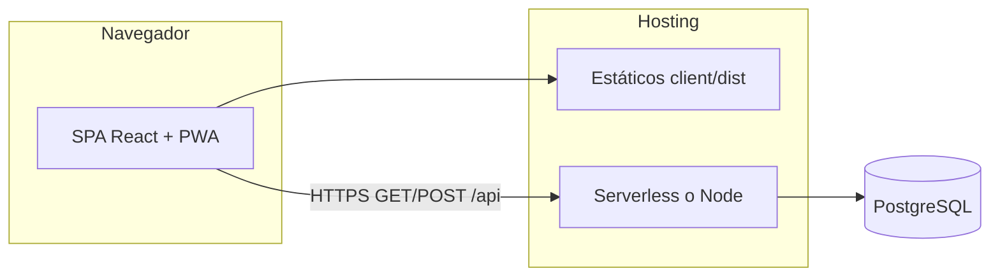

# Estudio Contable Eficiente (Contadores Unidos MX)

Monorepo con **Frontend** (React + Vite + Tailwind + Lucide + Recharts) y **Backend** (Node.js + Express + Prisma + PostgreSQL) listo para iteración del MVP.

## Arquitectura del sistema

Capas lógicas:

1. **Presentación (SPA):** React 19 + React Router; consume la API REST bajo `/api/*`; assets estáticos servidos por CDN/hosting (p. ej. Vercel).
2. **API HTTP:** Express montada en Node; misma app en **proceso local** (`server`) o en **función serverless** (`api/index.ts` en Vercel) que importa `server/src/app.ts`.
3. **Dominio:** lógica de negocio en `server/src/domain/*` (clientes, nómina, banca, etc.), desacoplada de Express salvo adaptadores en `http/routes`.
4. **Persistencia:** Prisma ORM → **PostgreSQL** (única fuente de verdad relacional).



Flujo típico: el usuario obtiene un **JWT** tras login; el cliente lo guarda y lo envía en `Authorization`; el middleware `authJwt` valida y adjunta `req.auth`; los servicios de dominio consultan o mutan datos vía Prisma.

## Requerimientos del producto (cliente / estudio contable)

Alcance funcional del **MVP** pensado para un estudio (p. ej. Contadores Unidos MX):

- **Acceso:** registro e inicio de sesión con correo y contraseña; sesión vía **JWT** en el navegador.
- **Clientes:** alta, listado, edición y baja con **RFC** (validación básica en UI); **exportación del listado a CSV** (UTF-8 con BOM para Excel).
- **Nómina:** cálculo quincenal de referencia (**IMSS + subsidio 2026**), parámetros ajustables (UMA, factor de integración, ISR estimado); **historial guardado** por usuario.
- **Facturación recurrente:** altas, listado, activar/desactivar y eliminar; estado de pago y saldo pendiente (MVP).
- **Conciliación bancaria:** movimientos de libro y líneas de estado de cuenta; **match 1:1**; importación **CSV**; sugerencias de match; categorías tras conciliar.
- **Declaraciones:** registro, listado, dashboard de estatus y baja.
- **Alertas:** semáforo por vencimientos (declaraciones + calendario mensual MVP).
- **Analytics:** panel de ingresos vs declaraciones y torta de facturas recurrentes.
- **Reportes:** PDF de **salud financiera** por mes (`YYYY-MM`).
- **Experiencia:** interfaz **responsive (mobile-first)**, **PWA** instalable y uso táctil en formularios/tablas principales.

**Requisitos en el navegador del usuario:** JavaScript activado; navegador actual (p. ej. últimas versiones de Chrome, Firefox, Safari o Edge). Para **instalar la PWA**, HTTPS en producción (p. ej. Vercel).

## Estructura de carpetas

Visión general del monorepo:

```text
estudio_contable/
├── api/                      # Entry serverless Vercel → reexporta la app Express
│   └── index.ts
├── client/                   # SPA React + Vite + Tailwind + PWA
│   ├── public/               # Estáticos (favicon, iconos PWA generados en build)
│   ├── scripts/              # p. ej. gen-pwa-icons.mjs
│   ├── src/
│   │   ├── components/       # UI reutilizable (Footer, tablas responsive, skeletons)
│   │   ├── hooks/            # Hooks (p. ej. useMediaQuery)
│   │   ├── layout/           # AppShell, navegación de módulos
│   │   ├── lib/              # api.ts, format-date, rfc, etc.
│   │   ├── pages/            # Pantallas por módulo (Clientes, Nómina, …)
│   │   ├── index.css
│   │   ├── main.tsx
│   │   └── router.tsx
│   ├── index.html
│   ├── vite.config.ts
│   └── package.json
├── server/                   # API Node + Express + Prisma
│   ├── prisma/               # schema.prisma + migraciones
│   └── src/
│       ├── config/           # env, Prisma client
│       ├── domain/           # Lógica por dominio (auth, clients, payroll, banking, …)
│       └── http/
│           ├── middlewares/  # JWT, validación body, errores
│           └── routes/         # Routers Express por recurso
├── package.json              # Workspaces + scripts raíz
├── package-lock.json
├── vercel.json
└── README.md
```

## Decisiones técnicas

| Decisión | Motivo |
|----------|--------|
| **Monorepo npm workspaces** | Un solo `package-lock.json`, scripts coordinados (`dev`, `build`) y versiones alineadas entre `client` y `server`. |
| **Prisma + PostgreSQL** | Modelo relacional explícito, migraciones versionadas y tipos generados para el servidor. |
| **JWT stateless** | Encaje simple con serverless (sin sesión en memoria en el proceso); el cliente guarda el token en `localStorage`. |
| **Express único + `api/index.ts`** | Misma aplicación en local y en Vercel; menos divergencia de código entre entornos. |
| **Dominio en `server/src/domain`** | Reglas de negocio testeables y routers delgados en `http/routes`. |
| **Vite 8 + PWA (Workbox)** | Build rápido, shell precacheado e instalación como app; `react-is` declarado explícitamente por **Recharts** y resolución bajo **Rolldown**. |
| **Tailwind utility-first** | Iteración rápida de UI responsive sin hojas CSS globales grandes. |
| **CSV con BOM UTF-8 en el cliente** | Sin nuevo endpoint ni carga al servidor: exporta la misma vista que ya está autenticada; Excel en Windows abre bien caracteres en español. |

## Requisitos técnicos (desarrollo y despliegue)

- **Node.js** 20+
- **npm** compatible con workspaces (p. ej. npm 9+)
- **PostgreSQL** (local o remoto, p. ej. Neon)
- Opcional: **Git** y cuenta en **Vercel** (o similar) para despliegue del frontend + función serverless

## Variables de entorno

- Backend: copiar `server/.env.example` a `server/.env` y ajustar:
  - `DATABASE_URL`
  - `JWT_SECRET`
  - `PORT` (opcional)
  - `CLIENT_ORIGIN` (opcional)

## Setup y desarrollo local

1. **Clonar** el repositorio y entrar a la raíz del monorepo.
2. **Instalar dependencias:** `npm install` (usa workspaces; conviene ejecutarlo desde la raíz).
3. **Variables de entorno:** copiar `server/.env.example` → `server/.env` y definir al menos `DATABASE_URL` y `JWT_SECRET` (ver sección [Variables de entorno](#variables-de-entorno)).
4. **Base de datos:** desde `server/`, `npm run prisma:generate` y `npm run prisma:migrate` (o el flujo de deploy de migraciones que uses).
5. **Arranque:** en la raíz, `npm run dev` (levanta API + cliente en paralelo).

URLs habituales:

- Frontend: `http://localhost:5173`
- API: `http://localhost:4000`
- Healthcheck: `GET http://localhost:4000/api/health`

### Build solo del cliente

```bash
npm run build -w client
```

El script de build del cliente ejecuta **`pwa:icons`** (genera `public/pwa-192.png` y `public/pwa-512.png`), TypeScript (`tsc -b`) y **Vite** (incluye Service Worker y `manifest.webmanifest` en `client/dist`).

Preview local del build estático:

```bash
npm run preview -w client
```

## Frontend: responsive y PWA

- **Mobile-first:** breakpoints con Tailwind (`sm`, `md` ≥768px tablet, `lg`, `xl` ≥1280px escritorio amplio).
- **Navegación:** en pantallas &lt; `md`, el menú lateral pasa a un **drawer** con botón hamburguesa; desde `md` se muestra el sidebar fijo.
- **Tablas:** en **Clientes**, **Facturación** y **Conciliación** (y listas similares como **Alertas**) la vista móvil usa **tarjetas por fila**; desde tablet/escritorio, tabla con **scroll horizontal táctil** donde aplica.
- **Formularios:** clases compartidas (`.field-touch`, `.btn-touch-primary`, etc.) con **altura mínima ~44px** y **ancho completo en móvil** para uso táctil.
- **PWA:** manifest **“Estudio Contable”**, tema `#0b1220`, iconos corporativos, **Service Worker** (precache + shell offline básico vía Workbox). En iOS/Android, meta tags para **“Añadir a inicio de pantalla”** / instalación como app.
- **Analytics:** gráficos Recharts dentro de contenedores con `min-w-0` y alturas adaptativas para evitar desbordes en pantallas pequeñas.

**Nota:** `react-is` es dependencia directa del cliente (Recharts lo importa); evita errores de resolución en **Vite 8 + Rolldown** al construir en CI (p. ej. Vercel).

**npm workspaces:** si ves `ignoring workspace config at client/.npmrc`, npm está ignorando el `.npmrc` dentro de `client` al ejecutar comandos desde ciertas rutas; para políticas de instalación globales del monorepo conviene un `.npmrc` en la **raíz** si hace falta (p. ej. `legacy-peer-deps` solo cuando aplique).

## Prisma (PostgreSQL)

Desde `server/`:

```bash
npm run prisma:generate
npm run prisma:migrate
```

En producción (p. ej. Vercel + Neon): `npm run prisma:migrate:deploy` desde la raíz del monorepo o el comando equivalente en tu pipeline.

La migración **`20260417160000_match_marked_invoice`** añade `markedRecurringInvoiceId` en `BankReconciliationMatch` para recordar qué factura recurrente pasó a **PAID** al conciliar un abono; al **desconciliar**, el sistema restaura **PENDING** y el saldo pendiente.

## Endpoints HTTP (`/api`)

Base URL local: `http://localhost:4000`. En Vercel, la misma ruta bajo el dominio del proyecto.

**Autenticación (endpoints protegidos):** header `Authorization: Bearer <token>`.

### Públicos

| Método | Ruta | Descripción |
|--------|------|-------------|
| `GET` | `/api/health` | Estado del API (sin JWT). |

### Auth (sin JWT en el request)

| Método | Ruta | Descripción |
|--------|------|-------------|
| `POST` | `/api/auth/register` | body: `{ "email", "password" (mín. 8) }` → `{ user, token }` |
| `POST` | `/api/auth/login` | body: `{ "email", "password" }` → `{ user, token }` |

### Clientes (JWT)

| Método | Ruta | Descripción |
|--------|------|-------------|
| `GET` | `/api/clients` | Lista clientes. |
| `GET` | `/api/clients/:id` | Detalle por id. |
| `POST` | `/api/clients` | body: `{ "name", "rfc", "regimen", "email?", "phone?" }` |
| `PATCH` | `/api/clients/:id` | Actualización parcial. |
| `DELETE` | `/api/clients/:id` | Elimina cliente. |

**Exportación CSV (valor agregado):** sin endpoint dedicado; en **Clientes** y **Facturación** los botones **Exportar CSV** generan el archivo en el navegador con **UTF-8 + BOM** (ver [Aportación extra](#aportación-extra-valor-agregado)).

### Nómina (JWT)

| Método | Ruta | Descripción |
|--------|------|-------------|
| `POST` | `/api/payroll/calculate` | Cálculo en memoria (no persiste). body: `salaryType` (`MONTHLY` o `DAILY`), `grossSalary`, `daysInPeriod` (1–16), `integrationFactor`, `umaDaily`, `payDate?` (ISO), `isrMonthlyEstimate?` → `{ data: { gross, imss, subsidy, netEstimate, disclaimers } }`. IMSS cuota obrera (EM, IV, CV, tope SBC 25 UMA); subsidio 2026 prorrateado. |
| `GET` | `/api/payroll/history` | Lista nóminas guardadas del usuario. |
| `POST` | `/api/payroll/history` | Guarda cálculo. body: mismos campos que **calculate** + `employeeName`, `fiscalYear?` (default 2026). Respuesta **HTTP 201**. |

### Facturación recurrente (JWT)

| Método | Ruta | Descripción |
|--------|------|-------------|
| `GET` | `/api/invoices/recurring` | Lista facturas recurrentes. |
| `POST` | `/api/invoices/recurring` | body: `{ "clientId", "concept", "amount", "currency", "frequency", "startDate", "nextRunDate", "active" }` |
| `PATCH` | `/api/invoices/recurring/:id` | body: p. ej. `{ "active": false }` |
| `DELETE` | `/api/invoices/recurring/:id` | Elimina recurrente. |

### Conciliación bancaria (JWT)

| Método | Ruta | Descripción |
|--------|------|-------------|
| `GET` | `/api/banking/movements` | Movimientos de libro. |
| `POST` | `/api/banking/movements` | body: `{ "date", "description", "reference?", "amount", "type": "DEBIT" o "CREDIT" }` |
| `PATCH` | `/api/banking/movements/:id/category` | body: `{ "category": "<texto>" }` o `{ "category": null }` (suele exigir movimiento conciliado). |
| `GET` | `/api/banking/statements` | Líneas de estado de cuenta. |
| `POST` | `/api/banking/statements` | Alta de línea (mismo shape que movimiento). |
| `POST` | `/api/banking/statements/import` | body: `{ "csv": "..." }`. Columnas aceptan sinónimos: `fecha` o `date`, `descripcion` o `description`, `referencia` o `reference`, `monto` o `amount`, `tipo` o `type`. |
| `POST` | `/api/banking/match/suggest` | body: `{ "statementLineId", "maxDaysDiff?" }` — sugerencias de movimiento. |
| `POST` | `/api/banking/match` | body: `{ "movementId", "statementLineId" }` — match 1:1. |
| `DELETE` | `/api/banking/match/movement/:movementId` | Quita match por movimiento. |

### Declaraciones (JWT)

| Método | Ruta | Descripción |
|--------|------|-------------|
| `GET` | `/api/declarations` | query opcional: `clientId`, `status`. |
| `GET` | `/api/declarations/dashboard` | Resumen por estatus. |
| `POST` | `/api/declarations` | body: `{ "clientId", "type", "status", "period" (YYYY-MM), "dueDate" (ISO), "notes?" }` |
| `PATCH` | `/api/declarations/:id` | Actualización. |
| `DELETE` | `/api/declarations/:id` | Baja. |

### Alertas (JWT)

| Método | Ruta | Descripción |
|--------|------|-------------|
| `GET` | `/api/alerts` | query: `daysAhead?` (default 30). Semáforo `GREEN` / `YELLOW` / `RED`; declaraciones + calendario mensual MVP (p. ej. día 17). |

### Analytics (JWT)

| Método | Ruta | Descripción |
|--------|------|-------------|
| `GET` | `/api/analytics/dashboard` | Métricas: año fiscal, ingresos por mes, declaraciones por mes, torta facturas pagadas vs pendientes. |

### Reportes PDF (JWT)

| Método | Ruta | Descripción |
|--------|------|-------------|
| `GET` | `/api/reports/financial-health.pdf?month=YYYY-MM` | PDF “Salud financiera”: ingresos vs gastos del mes en movimientos **conciliados**; top categorías; tendencia 3 meses; top 10 movimientos. |

## Despliegue en Vercel

El repo incluye `vercel.json`:

- **Serverless Function**: `api/index.ts`
- **Static Build**: `client/` (output `client/dist`)

En Vercel configura las env vars (al menos `DATABASE_URL` y `JWT_SECRET`).

El comando de build del proyecto suele ser **`npm run build -w client`** (o el equivalente en el panel de Vercel). Debe completar sin errores: si falla el bundler con **`react-is`**, confirma que `client/package.json` incluye la dependencia y que el **`package-lock.json`** está actualizado en el repo.

## UI (MVP)

Rutas principales (React Router): sin sesión solo se muestra **login**; con JWT, layout con sidebar / menú móvil:

| Ruta | Módulo |
|------|--------|
| `/` | Redirección a `/clients` |
| `/clients` | Clientes (CRUD + exportar CSV UTF-8) |
| `/analytics` | Dashboard de métricas (Recharts) + acceso al PDF de salud financiera |
| `/payroll` | Nómina quincenal |
| `/invoices` | Facturación recurrente (+ exportar CSV UTF-8) |
| `/banking` | Conciliación bancaria |
| `/declarations` | Declaraciones |
| `/alerts` | Alertas y PDF de salud financiera |

Footer: **Contadores Unidos MX** / **Estudio Contable Eficiente**; créditos **saoricoder**.

## Aportación extra (valor agregado)

Más allá del MVP base, el producto incorpora tres pilares que refuerzan el posicionamiento de **Contadores Unidos MX** como despacho orientado a datos y a la entrega profesional.

### Pilar 1: Motor de analytics proactivo

- **Qué es:** Dashboard visual con **Recharts** (barras combinadas y gráfico de torta) que muestra **ingresos mensuales** (movimientos bancarios **conciliados** a crédito), **actividad fiscal** (conteo de declaraciones por mes y estatus) y **facturas recurrentes** (pagadas vs pendientes).
- **Valor comercial:** Permite al estudio ofrecer **consultoría basada en datos** (tendencias de ingreso, carga de cumplimiento, cartera de cobro), no solo captura contable aislada.
- **Implementación:** El frontend consume **`GET /api/analytics/dashboard`**, donde el servicio `AnalyticsService` en el **servidor** agrega datos desde Prisma (movimientos conciliados, declaraciones del año fiscal, facturas recurrentes). La capa React compone series para Recharts y adapta layout responsive.

### Pilar 2: Reportes de salud financiera en PDF

- **Qué es:** Generación **dinámica** de un reporte ejecutivo **mensual** (ingresos vs gastos en movimientos conciliados, desglose por categoría, tendencia a 3 meses, top movimientos), descargable desde el módulo **Alertas** (y acceso rápido desde **Analytics** hacia Alertas).
- **Valor comercial:** Refuerza la **imagen profesional** del estudio ante clientes finales: entregable listo para enviar o archivar (PDF estándar, tipografía y bloques de KPI).
- **Implementación:** El PDF **no** se genera con *jspdf* ni *html2canvas* en el navegador; se construye en el **backend** con **PDFKit** (`server/src/domain/reports/pdf/financialHealthPdf.ts`), alimentado por `FinancialHealthService`, y se expone en **`GET /api/reports/financial-health.pdf?month=YYYY-MM`** con `Content-Type: application/pdf`. El cliente descarga el binario con el token JWT. En la UI, el botón incluye icono y estado de carga para evitar dobles envíos.

### Pilar 3: Sistema de exportación inteligente (CSV para contadores)

- **Qué es:** Exportación del listado de **clientes** y de **facturas recurrentes** a archivos **CSV** con codificación **UTF-8 con BOM** y escape de celdas (comillas, saltos de línea), optimizado para **Microsoft Excel en Windows** y tildes en nombres/RFC.
- **Valor comercial:** **Interoperabilidad** con Excel, auditorías, cruces con otros ERP o cargas a portales fiscales; reduce trabajo manual y errores de copiado.
- **Implementación:** Módulo **`client/src/lib/export-csv.ts`**: funciones `escapeCsvCell`, `buildClientsCsv`, `buildRecurringInvoicesCsv`, `downloadUtf8Csv` (BOM + `Blob` + descarga). Botones destacados con icono **Exportar CSV** en **Clientes** e **Invoices**; sin nuevos endpoints: los datos ya cargados vía API autenticada.

## Créditos

- **Desarrolladora:** saoricoder — [Instagram](https://instagram.com/saoricoder)

